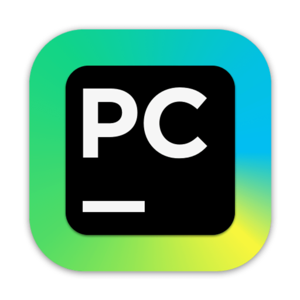

# Дипломный проект QA.GURU

Дипломной проект, выполненной в рамках обучения на курсе QA.GURU
Проект нацелен на демонстрацию полученных навыков и знаний в области автоматизации тестирования ПО.

> <a target="_blank" href="https://petrovich.ru/">Ссылка на тестируемый продукт</a>


<h3> Список проверок, реализованных в автотестах:</h3>

### UI-тесты
- [x] Изменение счетчика товаров в корзине
- [x] Добавление товара в корзину
- [x] Удаление товара в корзину
- [x] Изменение счетчика товаров в избранном
- [x] Добавление товара в избранное
- [x] Удаление товара в избранное

### API-тесты
- [x] Создание нового питомца
- [x] Получение питомцев по статусу
- [x] Удаление питомца

### ANDROID-тесты
- [x] Добавление товара в корзину

----
### Проект реализован с использованием:
          

----
### Локальный запуск
> Для локального запуска необходимо выполнить команду:
```
python -m venv .venv
source .venv/bin/activate
pip install -r requirements.txt
context={контекст} pytest -m {проект}  
```

----
### Удаленный запуск автотестов выполняется на сервере Jenkins
> <a target="_blank" href="https://jenkins.autotests.cloud/job/LitresTestProject/">Проект в Jenkins</a>

#### Параметры сборки

* `project` - проект
* `context` - контекст


#### Для запуска автотестов в Jenkins

1. Открыть <a target="_blank" href="https://jenkins.autotests.cloud/job/qa_guru_diplom_bubnov/">проект</a>
2. Выбрать пункт `Build with Parameters`
3. Выбрать проект
4. Выбрать контекст (см. описание)
5. Нажать кнопку `Build`
6. Результат запуска сборки можно посмотреть в отчёте Allure

----
### Отчет о прохождении тестов (Allure)
Для получения отчета нужно нажать на иконку allure report'a в строке билда  

